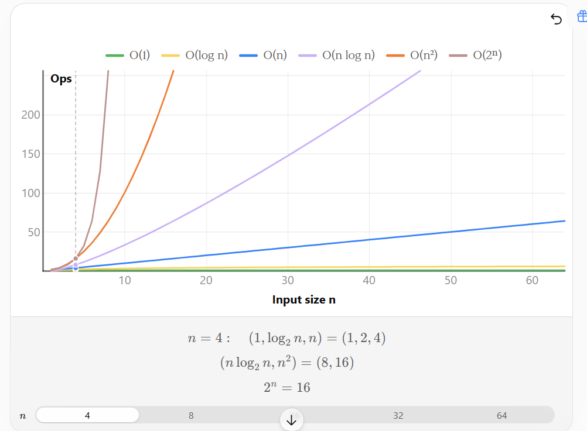

Yes. Before starting **Arrays**, it is better to have a short **DSA foundation**. Since your goal is Java/Spring Boot interviews, I'll keep this focused on what you actually need for DSA interviews.

# DSA — Introduction

## 1. What is DSA?

**DSA = Data Structures + Algorithms**

### Data Structure

A **Data Structure** is a way to organize and store data so that we can use it efficiently.

Examples:

```text
Array
String
Linked List
Stack
Queue
HashMap
HashSet
Tree
Heap
Graph
```

### Algorithm

An **Algorithm** is a step-by-step procedure to solve a problem.

Example:

> Find the largest number in an array.

Algorithm:

```text
1. Take the first element as maximum
2. Compare it with every other element
3. If a larger element is found, update maximum
4. Return maximum
```

So:

```text
Data Structure → How we store data
Algorithm      → How we process/solve using that data
```

---

# 2. Why DSA is Important?

For software engineering interviews, DSA tests whether you can:

* Break a problem into smaller steps
* Choose the right data structure
* Design an efficient solution
* Analyze time and memory usage
* Handle edge cases

For example:

### Problem

Find whether an array contains a duplicate.

You could use:

```text
Nested loops → O(n²)
```

or:

```text
HashSet → O(n) average
```

The interviewer wants to know **why you chose HashSet** and whether you understand the trade-off.

---

Note: Big O

**Big O notation** describes **how the time or memory used by an algorithm grows when the input size `n` grows**.

It helps us compare algorithms without depending on a specific computer or exact execution time.

### Simple example

Suppose you have:

```java
int[] nums = {10, 20, 30, 40, 50};
```

If you access:

```java
System.out.println(nums[3]);
```

You directly access the element using its index.

Whether the array has **5 elements or 5 million elements**, it still takes roughly one operation.

So:

**O(1) → Constant time**

---

### Common Big O complexities

genui{"learning_viz":{"type_id":"BIG_O_TIME_COMPLEXITY"}}

| Big O          | Meaning            | Example                 |
| -------------- | ------------------ | ----------------------- |
| **O(1)**       | Constant           | `array[i]`              |
| **O(log n)**   | Logarithmic        | Binary Search           |
| **O(n)**       | Linear             | Loop through array      |
| **O(n log n)** | Linear-logarithmic | Merge Sort              |
| **O(n²)**      | Quadratic          | Nested loops            |
| **O(2ⁿ)**      | Exponential        | Some recursive problems |

### Example: O(n)

```java
for (int i = 0; i < nums.length; i++) {
    System.out.println(nums[i]);
}
```

If:

* `n = 10` → ~10 operations
* `n = 100` → ~100 operations
* `n = 1,000` → ~1,000 operations

Therefore:

**Time Complexity = O(n)**

---

### Example: O(n²)

```java
for (int i = 0; i < n; i++) {
    for (int j = 0; j < n; j++) {
        System.out.println(i + " " + j);
    }
}
```

If:

* `n = 10` → 100 operations
* `n = 100` → 10,000 operations
* `n = 1,000` → 1,000,000 operations

Therefore:

**O(n²)**

---

### Why do we ignore constants?

Suppose:

```java
for (int i = 0; i < n; i++) {
    // work
}

for (int i = 0; i < n; i++) {
    // work
}
```

Technically, about `2n` operations.

But Big O represents the **growth rate**, so:

**O(2n) → O(n)**

Similarly:

**O(3n + 10) → O(n)**

---

### In your Two Sum example

Brute force:

```java
for (int i = 0; i < n; i++) {
    for (int j = i + 1; j < n; j++) {
        // check pair
    }
}
```

→ **O(n²)**

HashMap solution:

```java
for (int i = 0; i < n; i++) {
    // HashMap lookup
}
```

→ **O(n)** average time.

That's why the HashMap solution is better for large input.

### Remember this

> **Big O = How fast does the algorithm's resource usage grow as input size `n` grows?**

For DSA interviews, always try to identify:

**Time Complexity + Space Complexity.**



---

# 3. What is Time Complexity?

Time complexity describes **how the running time grows as the input size grows**.

We usually express it using **Big O notation**.

Suppose:

```java
int[] nums = new int[n];
```

where `n` is the number of elements.

---

## O(1) — Constant

Execution doesn't depend on `n`.

```java
int x = nums[0];
```

Whether the array contains:

```text
10 elements
or
10 million elements
```

accessing index `0` is essentially constant time.

```text
O(1)
```

---

## O(n) — Linear

We process every element once.

```java
for (int num : nums) {
    System.out.println(num);
}
```

For:

```text
n = 10      → ~10 operations
n = 100     → ~100 operations
n = 100000  → ~100000 operations
```

Therefore:

```text
O(n)
```

---

## O(n²) — Quadratic

Nested loops:

```java
for (int i = 0; i < n; i++) {
    for (int j = 0; j < n; j++) {
        // work
    }
}
```

Approximately:

```text
n × n = n²
```

Therefore:

```text
O(n²)
```

---

## O(log n)

The problem size is repeatedly reduced.

Classic example:

**Binary Search**

```text
100 elements
    ↓
50
    ↓
25
    ↓
12
    ↓
6
    ↓
3
    ↓
1
```

Complexity:

```text
O(log n)
```

---

## O(n log n)

Commonly seen in efficient sorting algorithms.

Examples:

```text
Merge Sort
Heap Sort
```

Complexity:

```text
O(n log n)
```

---

# 4. Complexity Order

For large input, generally:

```text
O(1)
 ↓
O(log n)
 ↓
O(n)
 ↓
O(n log n)
 ↓
O(n²)
 ↓
O(2ⁿ)
 ↓
O(n!)
```

**Smaller growth is generally better.**

---

# 5. Space Complexity

Space complexity tells us how much **additional memory** an algorithm requires.

Example:

```java
public static int findMax(int[] nums) {

    int max = nums[0];

    for (int num : nums) {
        if (num > max) {
            max = num;
        }
    }

    return max;
}
```

We only use:

```java
int max
```

regardless of the input size.

So auxiliary space:

```text
O(1)
```

---

### Example with extra array

```java
int[] copy = new int[nums.length];
```

If input has `n` elements, the new array has `n` elements.

Therefore:

```text
Space = O(n)
```

---

# 6. Time vs Space Trade-off

One of the most important DSA concepts.

Sometimes we use **more memory to make the algorithm faster**.

Example: Two Sum.

### Brute force

```text
Time  → O(n²)
Space → O(1)
```

### HashMap solution

```text
Time  → O(n)
Space → O(n)
```

We use additional memory to improve execution time.

This is called a:

> **Time-space trade-off**

---

# 7. What is an Input Constraint?

Before solving a DSA problem, always look at the constraints.

Example:

```text
1 <= n <= 100
```

An `O(n²)` solution may be perfectly acceptable.

But:

```text
1 <= n <= 100000
```

An `O(n²)` solution could be too slow.

So your thought process should be:

```text
Problem
   ↓
Constraints
   ↓
Choose approach
   ↓
Implement
   ↓
Analyze Time + Space
```

---

# 8. Brute Force vs Optimized Solution

### Brute Force

The simplest approach that tries all possibilities.

Example:

```text
Two Sum

Check every pair
→ O(n²)
```

### Optimized

Find a way to reduce unnecessary work.

```text
Two Sum + HashMap
→ O(n)
```

In interviews, a good approach is often:

1. Explain brute force.
2. Explain its complexity.
3. Identify why it's inefficient.
4. Optimize it.
5. Explain the trade-off.

---

Note: Brute Force

**Brute force** means solving a problem using the **most straightforward/basic approach**, usually by trying **all possible possibilities**, without using advanced optimization.

### Simple example: Two Sum

Given:

```text
nums = [2, 7, 11, 15]
target = 9
```

We need to find two numbers whose sum is `9`.

### Brute-force approach

Try **every possible pair**:

```text
2 + 7  = 9  ✅
2 + 11 = 13
2 + 15 = 17

7 + 11 = 18
7 + 15 = 22

11 + 15 = 26
```

Java:

```java
public static int[] twoSum(int[] nums, int target) {

    for (int i = 0; i < nums.length; i++) {

        for (int j = i + 1; j < nums.length; j++) {

            if (nums[i] + nums[j] == target) {
                return new int[]{i, j};
            }
        }
    }

    return new int[]{};
}
```

Complexity:

```text
Time  → O(n²)
Space → O(1)
```

### Optimized approach

Instead of checking every pair, use a `HashMap` to remember numbers we've already seen.

```text
Brute force:
Try everything → O(n²)

Optimized:
Use HashMap   → O(n) average
```

### Interview mindset

When an interviewer gives you a problem, think:

```text
Problem
   ↓
Can I solve it simply?
   ↓
Brute Force
   ↓
What's its complexity?
   ↓
Can I optimize it?
   ↓
Optimized Solution
```

**Important:** Brute force does **not** mean "wrong" or "bad code." It is often the correct **first solution** to establish the logic, after which you look for optimization.

**In one sentence:**

> **Brute force = try all possible/simple ways until you find the answer.**

Yes. Let's understand **Two Sum using HashMap step by step**, because this pattern is extremely important in DSA.

### Problem

```text
nums = [2, 7, 11, 15]
target = 9
```

We need indices of two numbers whose sum is `9`.

Expected:

```text
[0, 1]
```

---

## 1. Key idea

Instead of checking every pair, for each number ask:

> **What number do I need to reach the target?**

Formula:

```text
needed = target - current
```

For `2`:

```text
needed = 9 - 2
       = 7
```

So we need to know:

> "Have I already seen `7`?"

---

## 2. Use HashMap

We'll store:

```text
number → index
```

For example:

```text
2 → 0
7 → 1
11 → 2
15 → 3
```

---

## 3. Step-by-step

Initially:

```text
map = {}
```

### i = 0

Current:

```text
nums[0] = 2
```

Calculate:

```text
needed = 9 - 2 = 7
```

Check:

```text
Does map contain 7?
```

No.

So store:

```text
map.put(2, 0)
```

Now:

```text
map = {2 → 0}
```

---

### i = 1

Current:

```text
nums[1] = 7
```

Calculate:

```text
needed = 9 - 7 = 2
```

Check:

```text
Does map contain 2?
```

**Yes!**

We stored:

```text
2 → 0
```

Therefore:

```text
index of 2 = 0
index of 7 = 1
```

Return:

```text
[0, 1]
```

We don't even need to process `11` or `15`.

---

# 4. Full Working Java Code

```java
import java.util.HashMap;
import java.util.Arrays;

public class Main {

    public static int[] twoSum(int[] nums, int target) {

        HashMap<Integer, Integer> map = new HashMap<>();

        for (int i = 0; i < nums.length; i++) {

            int current = nums[i];

            int needed = target - current;

            // Check if we have already seen the required number
            if (map.containsKey(needed)) {

                return new int[]{
                    map.get(needed),
                    i
                };

                // note: You cannot assign {...} directly to an array variable res = {map.get(needed), i}; -> This is invalid:
            }

            // Store current number and its index
            map.put(current, i);
        }

        return new int[]{};
    }

    public static void main(String[] args) {

        int[] nums = {2, 7, 11, 15};
        int target = 9;
        System.out.println(Arrays.toString(nums));
        int[] result = twoSum(nums, target);

        System.out.println(Arrays.toString(result));
    }
}
```

Output:

```text
[0, 1]
```

---

## 5. Why is this faster?

### Brute force

```java
for (...) {
    for (...) {
        // check pair
    }
}
```

Two loops → **O(n²)**

### HashMap

```java
for (...) {
    map.containsKey(...);
}
```

One loop + HashMap lookup → **O(n)** average.

So:

```text
                Time       Space

Brute Force     O(n²)      O(1)

HashMap         O(n)       O(n)
```

We use **extra memory** to reduce the **time**.

This is the **time-space tradeoff** we discussed.

---

## 6. The most important pattern to remember

Whenever you see a problem like:

> "Find two numbers that satisfy some condition"

Think:

```text
current
   ↓
What do I need?
   ↓
target - current
   ↓
Have I seen it before?
   ↓
HashMap / HashSet
```

For Two Sum specifically:

```java
int needed = target - nums[i];

if (map.containsKey(needed)) {
    return new int[]{map.get(needed), i};
}

map.put(nums[i], i);
```

**This 4-line pattern is worth understanding deeply**, because the same HashMap idea appears in many DSA problems beyond Two Sum.

---

# 9. Common DSA Problem-Solving Patterns

You don't need to memorize individual problems.

You need to recognize **patterns**.

### 1. Traversal

Process elements one by one.

```text
Array
String
Linked List
Tree
```

---

### 2. Two Pointers

Use two indexes/pointers.

```text
left →       ← right
```

Common in:

* Reverse Array
* Two Sum sorted
* Remove duplicates
* Container With Most Water

---

### 3. Sliding Window

Maintain a moving range.

```text
[ left ........ right ]
```

Common in:

* Maximum sum subarray
* Longest substring
* Longest subarray problems

---

### 4. Hashing

Use:

```java
HashMap
HashSet
```

Common in:

* Frequency counting
* Duplicate detection
* Two Sum
* Grouping

---

### 5. Binary Search

Used when the search space can be repeatedly divided.

```text
O(log n)
```

---

### 6. Recursion

A function calls itself.

```java
void solve() {
    solve();
}
```

Used heavily in:

* Trees
* Backtracking
* Divide and conquer
* DFS

---

### 7. Dynamic Programming

Break a problem into overlapping subproblems and store previously calculated results.

Usually:

```text
Recursion
    ↓
Memoization
    ↓
Tabulation
    ↓
Space optimization
```

---

# 10. Important DSA Concepts You Should Know

Your overall DSA journey should cover:

```text
DSA
│
├── Fundamentals
│   ├── Time Complexity
│   ├── Space Complexity
│   ├── Big O
│   ├── Recursion basics
│   └── Problem-solving approach
│
├── Arrays
├── Strings
├── Linked List
├── Stack
├── Queue
├── HashMap / HashSet
├── Searching
│   ├── Linear Search
│   └── Binary Search
├── Sorting
│   ├── Bubble
│   ├── Selection
│   ├── Insertion
│   ├── Merge
│   └── Quick Sort
│
├── Recursion
├── Backtracking
├── Trees
├── Binary Search Tree
├── Heap / Priority Queue
├── Graphs
└── Dynamic Programming
```

---

# 11. How We Will Study Each Topic

For **every DSA topic**, I'll follow this structure:

```text
1. What is it?
2. Why do we need it?
3. How does it work?
4. Java implementation
5. Time complexity
6. Space complexity
7. Important operations
8. Common patterns
9. Interview problems
10. Brute force → optimized approach
11. Edge cases
12. Short revision notes
```

For example, for **Arrays**, we'll learn:

```text
DSA Introduction
       ↓
Arrays
       ↓
Array operations
       ↓
Traversal
       ↓
Two Pointers
       ↓
Prefix Sum
       ↓
Sliding Window
       ↓
Hashing with Arrays
       ↓
Binary Search
       ↓
Kadane's Algorithm
       ↓
2D Arrays
       ↓
Interview Problems
```

### One important rule for you

Since you're learning **Java for a React → Spring Boot/full-stack transition**, don't focus on memorizing code.

For every problem, train yourself to answer these four questions:

> **1. What is the brute-force approach?**
> **2. Can I optimize it?**
> **3. Why is my data structure/pattern appropriate?**
> **4. What are the time and space complexities?**

Once these become natural, your DSA interview performance will improve significantly.

**Next: Arrays** — we can start from the absolute basics and then progressively move into the important interview patterns and problems.
